# UML Diagrams — Indus–Keeladi CNN

> PlantUML sources for the Indus–Keeladi CNN project.
> Companion to [`ARCHITECTURE.md`](ARCHITECTURE.md).
> The same sources also exist as standalone `.puml` files in `docs/uml/`.

## How to render

**VS Code** — install the *PlantUML* extension (jebbs), open a `.puml` file, press `Alt+D`.

**IntelliJ / JetBrains** — install *PlantUML Integration*.

**CLI (any OS)**

```bash
pip install plantuml
plantuml docs/uml/some_diagram.puml          # writes a .png next to the source
plantuml -tpdf docs/uml/some_diagram.puml    # or PDF
plantuml -tsvg  docs/uml/some_diagram.puml   # or SVG (best for print figures)
```

**Online** — <https://www.plantuml.com/plantuml/umlviewer> — paste and render.

## Index

| # | Diagram | File | Purpose |
|---|---|---|---|
| 1 | System Context (C4) | `01_system_context.puml` | Project boundary, actors, external systems |
| 2 | Component | `02_component.puml` | Modules and their dependencies |
| 3 | Class — Preprocessing & Model | `03_class_preprocessing_model.puml` | `ImageNormalizer`, `GridDecomposer`, `IndusClassifierCNN`, `WeightTransfer` |
| 4 | Class — Training & Evaluation | `04_class_training_evaluation.puml` | `IndusKeeladiTrainer`, `KeeladiEvaluator`, `InscriptionDecoder` |
| 5 | Class — Audit & Matching | `05_class_audit_matching.puml` | `audit_validity`, `sign_matcher`, `siamese_embed`, `digitise_fig65` |
| 6 | Sequence — Full Pipeline | `06_sequence_pipeline.puml` | `run_pipeline.main()` step by step |
| 7 | Sequence — Training | `07_sequence_training.puml` | Data load → augment → fit → save |
| 8 | Sequence — Evaluation | `08_sequence_evaluation.puml` | Sherd → predict → report |
| 9 | Activity — Preprocessing | `09_activity_preprocessing.puml` | `ImageNormalizer.process_image()` |
| 10 | Activity — Validity Audit | `10_activity_audit.puml` | The three audits |
| 11 | State — Model Lifecycle | `11_state_model_lifecycle.puml` | Untrained → trained → audited → reported |
| 12 | Deployment | `12_deployment.puml` | Runtime nodes and artefacts |
| 13 | Package / Namespace | `13_packages.puml` | Directory-to-namespace mapping |
| 14 | Use Case | `14_use_case.puml` | What each user-facing script lets you do |

---

## 1. System Context

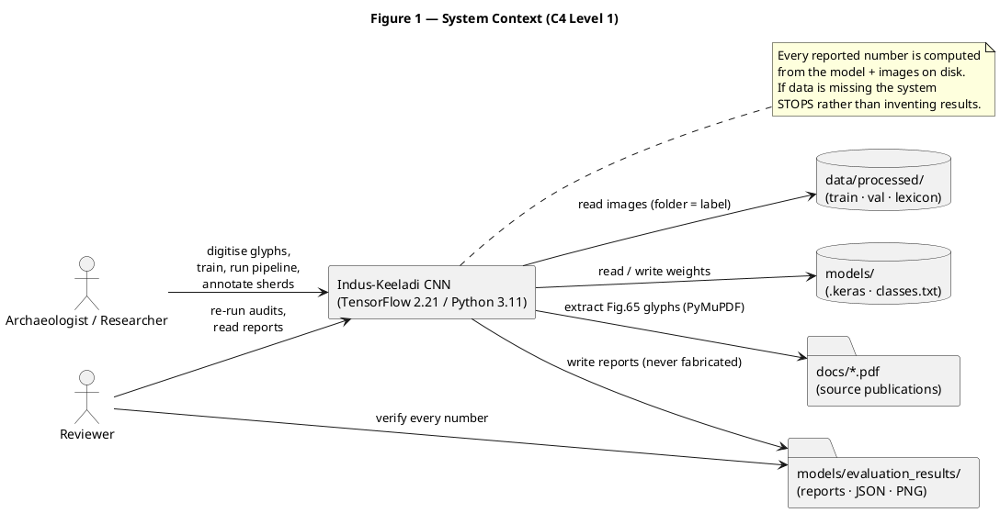

---

## 2. Component Diagram

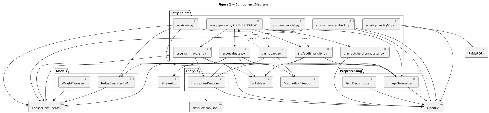
---

## 3. Class Diagram — Preprocessing & Model

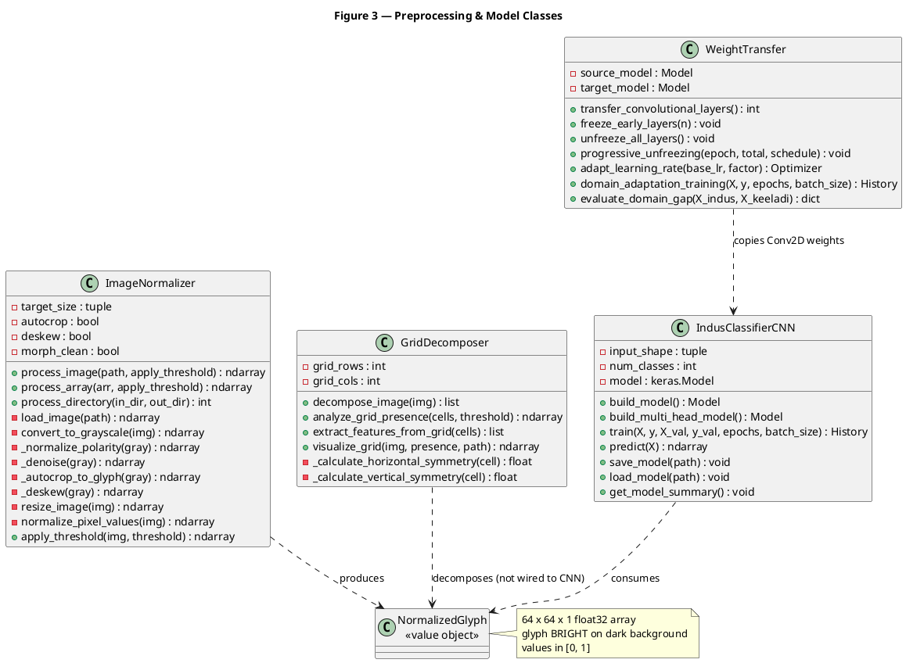

---

## 4. Class Diagram — Training & Evaluation

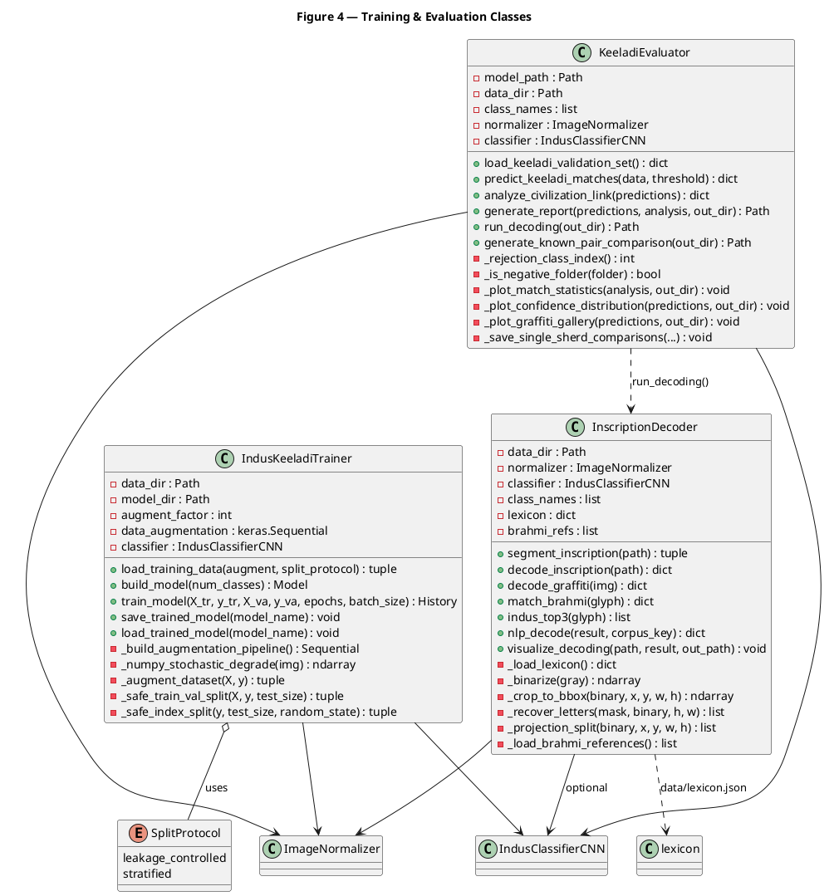

## 5. Class Diagram — Audit & Matching

```plantuml
@startuml
title Figure 5 — Audit, Retrieval & Digitisation

class "audit_validity\n<<module functions>>" as AV {
  + run_audit(model_path, data_dir, out_dir, n_perm) : dict
  + leakage_audit(X, y, groups, test_size, thresh, seed) : dict
  + openset_audit(model, class_names, normalizer, data_dir, n_pos, seed) : dict
  + verification_audit(model, class_names, normalizer, data_dir, n_perm, seed) : dict
  + write_report(audit, out_dir) : Path
  + load_train_corpus(data_dir, class_names, normalizer) : tuple
  + load_class_names(model_path) : list
  + load_classifier(model_path) : Model
  + predict_probs(model, images) : ndarray
  + expected_classes(folder) : list
  - _contamination(X, train_idx, val_idx, thresh) : dict
  - _negative_groups(normalizer, data_dir) : list
}

class "sign_matcher\n<<module functions>>" as SM {
  + match_all(model_path, data_dir, n_perm, seed) : dict
  + write_report(result, out_dir) : Path
  + binarize(gray) : ndarray
  + largest_component_mask(binary, size) : ndarray
  + stroke_coverage(a, b, dilate_iters) : float
  + embed_model(model) : Model
  + build_class_references(data_dir, class_names, limit) : dict
  + prototype_embeddings(embedder, refs) : ndarray
  + extract_glyphs(decoder, sherd_path) : list
  + score_sherd(glyphs, embedder, protos, refs, class_names) : dict
}

class "siamese_embed\n<<module functions>>" as SE {
  + load_glyphs() : list
  + fit_canvas(img, size, margin) : ndarray
  + augment(img, rng) : ndarray
  + build_dataset(items, per_class, seed) : tuple
  + build_test(items, seed) : tuple
  + build_reference(items) : ndarray
  + make_model() : Model
  + margin_triplet(emb, labels, margin) : scalar
  + train(items, epochs, per_class, batch, seed) : Model
  + retrieval_report(model, items, Xte, yte) : dict
  + per_class_report(model, items, Xte, yte) : dict
}

class "digitise_fig65\n<<module functions>>" as DG {
  + digitise(pdf, out_dir, zoom) : dict
  + table_rules(page) : tuple
  + clean_crop(img) : ndarray
  + contact_sheet(out, cell, cols) : Path
  + debug_page(pno) : void
  - _serial_anchors(page, serials) : dict
  - _words(page) : list
  - _bracket(values, lo, hi) : tuple
}

class AuditResult <<value object>>
class SherdScore <<value object>>
class "Fig65Glyph\n<<value object>>" as FG

note right of FG
  serial · nfm · m1977 · p2010
  is_stroke_sign
  (from manifest.json)
end note

AV --> ImageNormalizer : uses
AV --> FG : reads manifest
SM --> ImageNormalizer : uses
SM ..> InscriptionDecoder : segment_inscription()
SM ..> AuditResult : writes
SE --> FG : loads
SE ..> AuditResult : retrieval_report()
DG ..> FG : produces
AV ..> AuditResult : produces
@enduml
```

---

## 6. Sequence — Full Pipeline

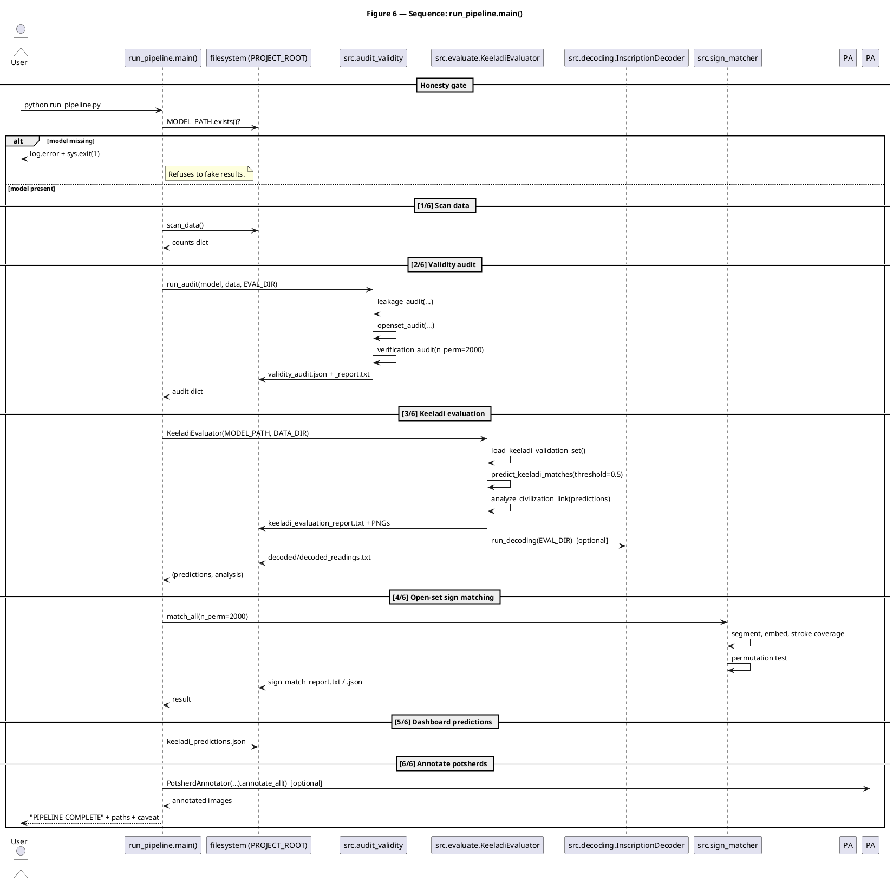
---

## 7. Sequence — Training

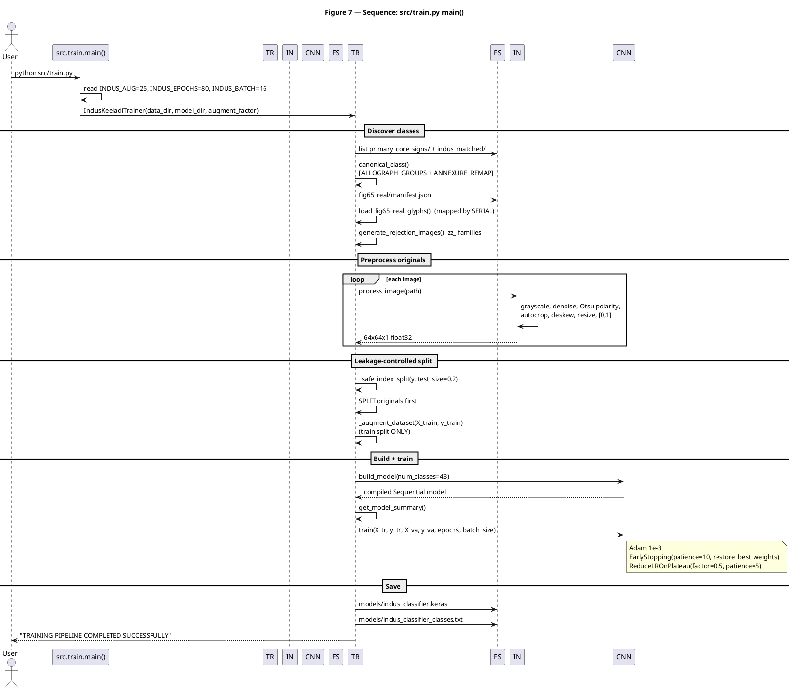

---

## 8. Sequence — Evaluation

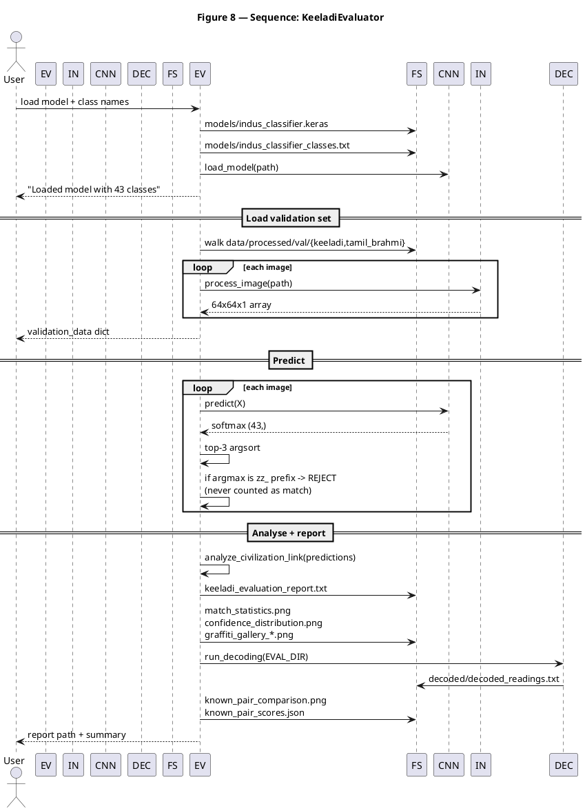

---

## 9. Activity — Preprocessing

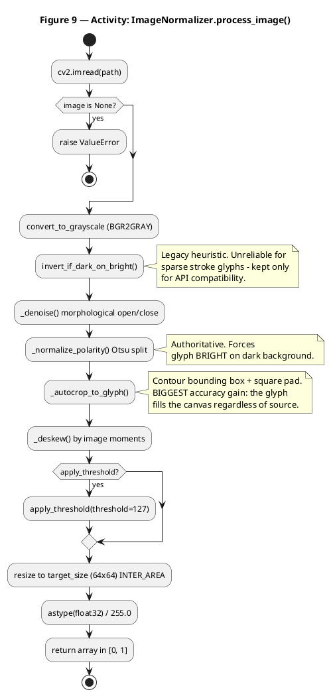

---

## 10. Activity — Validity Audit

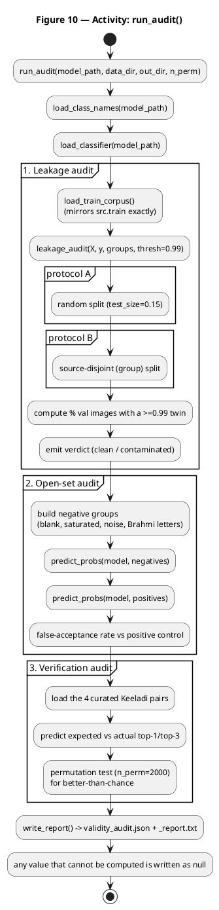
---

## 11. State — Model Lifecycle

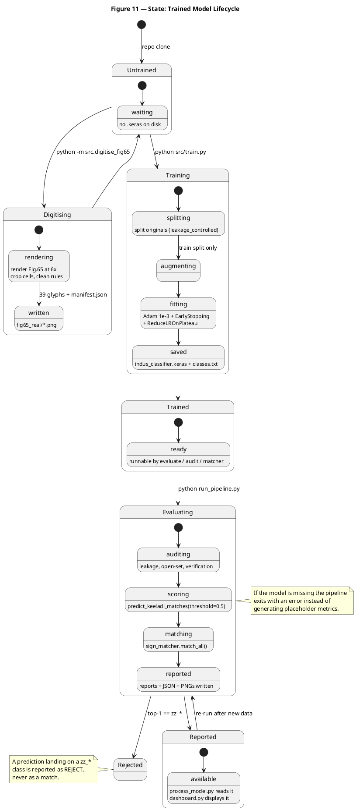

---

## 12. Deployment Diagram

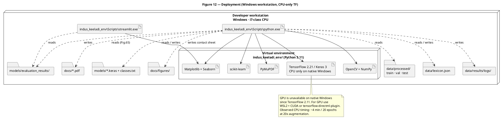

## 13. Package / Namespace Diagram

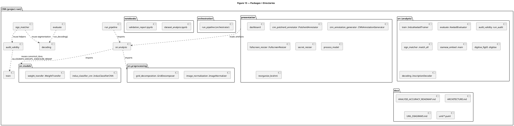

---

## 14. Use Case Diagram

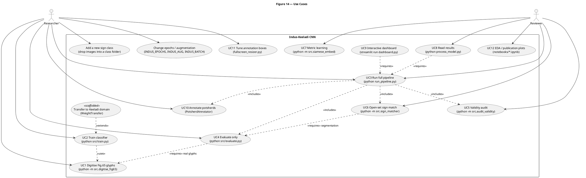

---

## Diagram Conventions

| Convention | Meaning |
|---|---|
| `-->` | Direct call / data flow |
| `..>` | Dependency, import, or "uses/includes" |
| `o--` | Aggregation |
| `<<value object>>` | Immutable data holder |
| `<<scaffolded>>` | Implemented but never executed on real data |
| `#` prefix | Private member |
| `+` prefix | Public member |

## Validating the sources

Render them all at once:

```powershell
python -m pip install plantuml
Get-ChildItem docs\uml\*.puml | ForEach-Object { plantuml -tsvg $_.FullName }
```

Any syntax error is reported on stderr with the offending line number.
  PY --> PMU
  ST --> MP

  PY ..> D1 : reads
  PY ..> D2 : reads / writes
  PY ..> D3 : writes
  PY ..> D4 : reads (Fig.65)
  PY ..> M1 : reads / writes
  PY ..> M2 : writes
  PY ..> D5 : writes contact sheet
  ST ..> M2 : reads
}

note bottom of TF
  GPU is unavailable on native Windows
  since TensorFlow 2.11. For GPU use
  WSL2 + CUDA or tensorflow-directml-plugin.
  Observed CPU timing: ~4 min / 20 epochs
  at 20x augmentation.
end note
@enduml
```
  :leakage_audit(X, y, groups, thresh=0.99);
  partition "protocol A" {
    :random split (test_size=0.15);
  }
  partition "protocol B" {
    :source-disjoint (group) split;
  }
  :compute % val images with a >=0.99 twin;
  :emit verdict (clean / contaminated);
}

partition "2. Open-set audit" {
  :build negative groups\n(blank, saturated, noise, Brahmi letters);
  :predict_probs(model, negatives);
  :predict_probs(model, positives);
  :false-acceptance rate vs positive control;
}

partition "3. Verification audit" {
  :load the 4 curated Keeladi pairs;
  :predict expected vs actual top-1/top-3;
  :permutation test (n_perm=2000) for better-than-chance;
}

:write_report() -> validity_audit.json + _report.txt;
:any value that cannot be computed is written as null;
stop
@enduml
```
  EV --> RP : (predictions, analysis)

  == [4/6] Open-set sign matching ==
  RP -> SM : match_all(n_perm=2000)
  SM -> SM : segment, embed, stroke coverage
  SM -> SM : permutation test
  SM -> FS : sign_match_report.txt / .json
  SM --> RP : result

  == [5/6] Dashboard predictions ==
  RP -> FS : keeladi_predictions.json

  == [6/6] Annotate potsherds ==
  RP -> PA : PotsherdAnnotator(...).annotate_all()  [optional]
  PA --> RP : annotated images

  RP --> User : "PIPELINE COMPLETE" + paths + caveat
end
@enduml
```
  + predict_keeladi_matches(data, threshold) : dict
  + analyze_civilization_link(predictions) : dict
  + generate_report(predictions, analysis, out_dir) : Path
  + run_decoding(out_dir) : Path
  + generate_known_pair_comparison(out_dir) : Path
  - _rejection_class_index() : int
  - _is_negative_folder(folder) : bool
  - _plot_match_statistics(analysis, out_dir) : void
  - _plot_confidence_distribution(predictions, out_dir) : void
  - _plot_graffiti_gallery(predictions, out_dir) : void
  - _save_single_sherd_comparisons(...) : void
}

class InscriptionDecoder {
  - data_dir : Path
  - normalizer : ImageNormalizer
  - classifier : IndusClassifierCNN
  - class_names : list
  - lexicon : dict
  - brahmi_refs : list
  + segment_inscription(path) : tuple
  + decode_inscription(path) : dict
  + decode_graffiti(img) : dict
  + match_brahmi(glyph) : dict
  + indus_top3(glyph) : list
  + nlp_decode(result, corpus_key) : dict
  + visualize_decoding(path, result, out_path) : void
  - _load_lexicon() : dict
  - _binarize(gray) : ndarray
  - _crop_to_bbox(binary, x, y, w, h) : ndarray
  - _recover_letters(mask, binary, h, w) : list
  - _projection_split(binary, x, y, w, h) : list
  - _load_brahmi_references() : list
}

enum SplitProtocol {
  leakage_controlled
  stratified
}

IndusKeeladiTrainer o-- SplitProtocol : uses
IndusKeeladiTrainer --> ImageNormalizer
IndusKeeladiTrainer --> IndusClassifierCNN
KeeladiEvaluator --> ImageNormalizer
KeeladiEvaluator --> IndusClassifierCNN
KeeladiEvaluator ..> InscriptionDecoder : run_decoding()
InscriptionDecoder --> ImageNormalizer
InscriptionDecoder --> IndusClassifierCNN : optional
InscriptionDecoder ..> lexicon : data/lexicon.json
@enduml
```